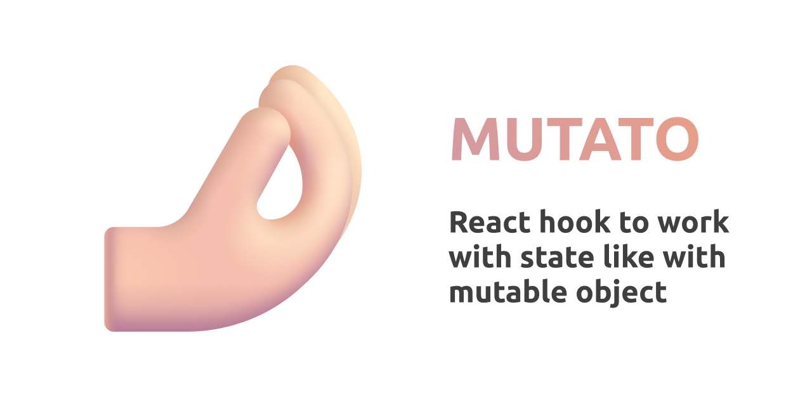

How I acspect it to work. It's aspesially comfortable during working with arrays.

```ts
const SwapComponent = () => {
  const [items, mutateItems] = useMutato<string[]>(['a', 'b'])

  // simple swap of 2 items
  const swap = () => mutateItems(items => {
    const first = items[0]
    items[0] = items[1]
    items[1] = first
  })

  return items.map(item => <div>{item}</div>)
}
```